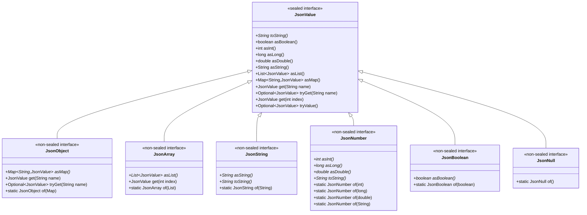
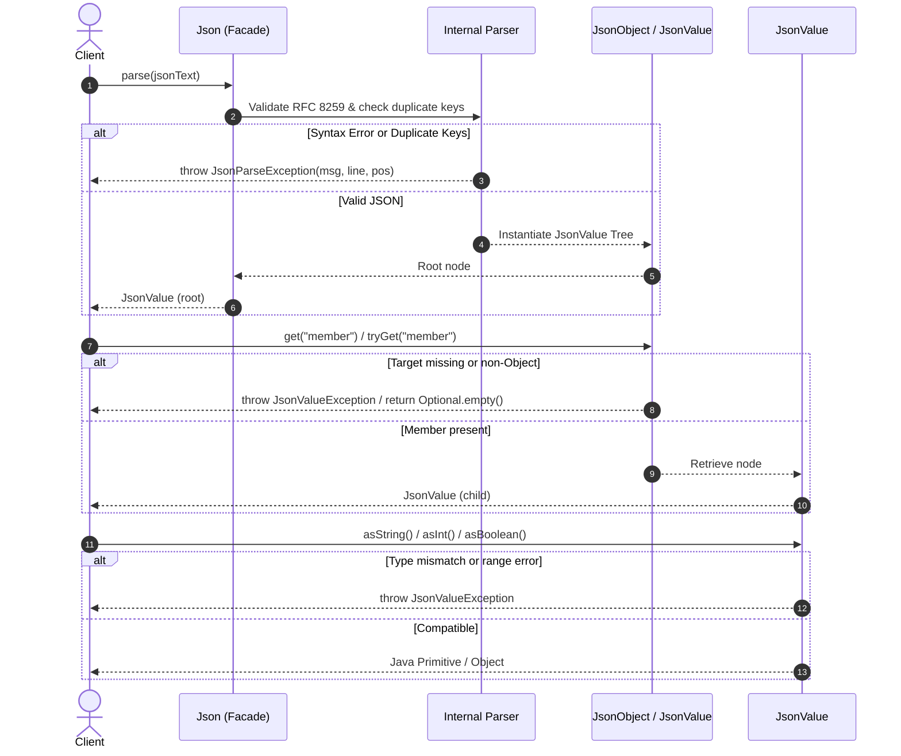

# JDK 28 Incubator JSON API (`jdk.incubator.json`) Research Document

> **Source:** Javadoc generated from `DRAFT 28-internal-nsato.open` (Java SE 28 & JDK 28 [ad-hoc build])  
> **Status:** Incubator module — specification is not final and is subject to change.  
> **Standard:** [RFC 8259 – The JavaScript Object Notation (JSON) Data Interchange Format](https://www.rfc-editor.org/rfc/rfc8259)

---

## 1. Executive Summary & Overview

### Module Status

`jdk.incubator.json` is an **incubator module**. As with all incubator modules it is not part of the Java SE standard module graph and must be explicitly added with `--add-modules jdk.incubator.json`.

The entire public API lives in a single package — **`jdk.incubator.json`** — and is intentionally minimal. There are no builder types, streaming parsers, or data-binding facilities. The design philosophy is to provide a small, opinionated surface that covers the three fundamental operations on JSON data: **parsing**, **traversal/retrieval**, and **generation (serialisation)**.

### Design Goals

| Goal | Mechanism |
|---|---|
| **Parsing** | [`Json.parse(String)`](Json.html) / [`Json.parse(char[])`](Json.html) — produces a [`JsonValue`](JsonValue.html) tree from well-formed JSON text |
| **Traversal / retrieval** | Chained [`get(String)`](JsonObject.html:346) / [`get(int)`](JsonArray.html:332) / [`tryGet(String)`](JsonObject.html:356) / [`tryValue()`](JsonValue.html:737) access methods on [`JsonValue`](JsonValue.html) |
| **Type conversion** | Typed terminal methods: [`asString()`](JsonString.html:324), [`asInt()`](JsonNumber.html:324), [`asLong()`](JsonNumber.html:338), [`asDouble()`](JsonNumber.html:353), [`asBoolean()`](JsonBoolean.html:323), [`asMap()`](JsonObject.html:336), [`asList()`](JsonArray.html:322) |
| **Generation (compact)** | [`JsonValue.toString()`](JsonValue.html:452) — produces RFC 8259 compliant, whitespace-free JSON text |
| **Generation (display)** | [`Json.toDisplayString(JsonValue, int)`](Json.html:343) — produces human-friendly, indented JSON text |
| **RFC 8259 compliance** | Both parsing and generation are strictly defined against RFC 8259 |
| **Duplicate-key rejection** | Parsing a JSON object with duplicate member names throws [`JsonParseException`](JsonParseException.html); constructing one via [`JsonObject.of(Map)`](JsonObject.html:379) with duplicate names throws `IllegalArgumentException` |
| **Programmatic construction** | Static factory `of(…)` methods on each value type ([`JsonObject.of(Map)`](JsonObject.html:379), [`JsonArray.of(List)`](JsonArray.html:353), [`JsonString.of(String)`](JsonString.html:341), [`JsonNumber.of(int)`](JsonNumber.html:367), [`JsonBoolean.of(boolean)`](JsonBoolean.html:337), [`JsonNull.of()`](JsonNull.html:321)) |

### Key Types at a Glance

```
JsonValue                  (sealed interface — root of the type hierarchy)
├── JsonObject             (non-sealed interface — JSON object: { … })
├── JsonArray              (non-sealed interface — JSON array:  [ … ])
├── JsonString             (non-sealed interface — JSON string)
├── JsonNumber             (non-sealed interface — JSON number, arbitrary-precision)
├── JsonBoolean            (non-sealed interface — JSON true / false)
└── JsonNull               (non-sealed interface — JSON null)

Json                       (final class — static parse / toDisplayString entry points)
JsonParseException         (final class extends RuntimeException — parse failures)
JsonValueException         (final class extends RuntimeException — traversal/conversion failures)
```

### The Three-Phase Usage Pattern

The API enforces a clear three-phase model for working with JSON:

1. **Parse** — call [`Json.parse(…)` ](Json.html) once to obtain a root [`JsonValue`](JsonValue.html). A successful return guarantees the input is syntactically valid RFC 8259 JSON with no duplicate object member names.

2. **Navigate** — call [`get(String)`](JsonObject.html:346) (for object members), [`get(int)`](JsonArray.html:332) (for array elements), [`tryGet(String)`](JsonObject.html:356) (for optional members), and [`tryValue()`](JsonValue.html:737) (for JSON-null–safe access) in a fluent chain to reach the target node.

3. **Convert** — call the appropriate terminal `as*()` method on the final [`JsonValue`](JsonValue.html) to obtain a Java primitive or collection (`String`, `int`, `long`, `double`, `boolean`, `Map<String, JsonValue>`, `List<JsonValue>`).

The same types used for navigation are also used for programmatic document construction via `of(…)` factories, making round-tripping straightforward.

### Error Model

Two unchecked exceptions cover all failure cases:

- **[`JsonParseException`](JsonParseException.html)** — thrown during Phase 1 (parsing). Carries zero-based [`getErrorLine()`](JsonParseException.html:324) and [`getErrorPosition()`](JsonParseException.html:335) (in UTF-16 code units) to pinpoint the location of the syntax error. Also thrown when duplicate member names are detected at parse time.
- **[`JsonValueException`](JsonValueException.html)** — thrown during Phase 2 (navigation) or Phase 3 (conversion). Covers: type mismatch on access or conversion, missing member name ([`get(String)`](JsonObject.html:346) on absent key), out-of-bounds index ([`get(int)`](JsonArray.html:332) beyond array length), and numeric range/precision overflow ([`asInt()`](JsonNumber.html:324), [`asLong()`](JsonNumber.html:338), [`asDouble()`](JsonNumber.html:353) when the value cannot be faithfully represented).

### Notable Design Decisions

- **[`JsonValue`](JsonValue.html) is a `sealed interface`** permitting exactly six subtypes. This makes exhaustive `instanceof` pattern-matching and `switch` expressions on JSON type safe and compiler-checked.
- **[`JsonNumber`](JsonNumber.html) is arbitrary-precision** — numbers are stored as their raw string representation and only converted at the point of [`asInt()`](JsonNumber.html:324) / [`asLong()`](JsonNumber.html:338) / [`asDouble()`](JsonNumber.html:353) / [`toString()`](JsonNumber.html:360). Callers needing exact large numbers should use [`toString()`](JsonNumber.html:360) to feed `BigDecimal` or `BigInteger`.
- **[`asMap()`](JsonObject.html:336) and [`asList()`](JsonArray.html:322) return unmodifiable collections.** The underlying `Map` and `List` preserve insertion order (in JDK implementation) but cannot be mutated.
- **[`JsonString.toString()`](JsonString.html:334) returns the JSON-encoded form** (with quotes and escape sequences), while [`asString()`](JsonString.html:324) returns the decoded Java `String`.
- **No null Java references in the API surface** — [`tryGet(String)`](JsonObject.html:356) and [`tryValue()`](JsonValue.html:737) return `Optional<JsonValue>` rather than nullable references, pushing JSON-null handling into idiomatic Optional chains.

---

## 2. Architecture & Type Hierarchy Overview

The API architecture centers on a single root interface [`JsonValue`](JsonValue.html) and a final utility class [`Json`](Json.html).

### Type Hierarchy Diagram



### Container vs. Scalar Types

The six permitted implementations split cleanly into structural containers and scalar values:

1. **Structural Container Types**
   - **[`JsonObject`](JsonObject.html)**: Represents a JSON object (`{ "k": "v" }`). Does not implement `java.util.Map` directly; instead exposes [`asMap()`](JsonObject.html:336) returning an unmodifiable `Map<String, JsonValue>`. Provides default navigation helpers [`get(String)`](JsonObject.html:346) and [`tryGet(String)`](JsonObject.html:356).
   - **[`JsonArray`](JsonArray.html)**: Represents a JSON array (`[ 1, 2, 3 ]`). Does not implement `java.util.List` directly; exposes [`asList()`](JsonArray.html:322) returning an unmodifiable `List<JsonValue>`. Provides index-based navigation helper [`get(int)`](JsonArray.html:332).

2. **Scalar Value Types**
   - **[`JsonString`](JsonString.html)**: Encapsulates text. Overrides both [`asString()`](JsonString.html:324) (returns decoded Java `String`) and [`toString()`](JsonString.html:334) (returns quoted JSON representation).
   - **[`JsonNumber`](JsonNumber.html)**: Stores base-10 numerical input in raw textual form. Provides conversions to [`asInt()`](JsonNumber.html:324), [`asLong()`](JsonNumber.html:338), and [`asDouble()`](JsonNumber.html:353), throwing [`JsonValueException`](JsonValueException.html) if conversion cannot be performed losslessly or if out of range.
   - **[`JsonBoolean`](JsonBoolean.html)**: Wraps `true` or `false`. Overrides [`asBoolean()`](JsonBoolean.html:323).
   - **[`JsonNull`](JsonNull.html)**: Represents JSON `null`. Inherits default conversion methods that throw [`JsonValueException`](JsonValueException.html) and overrides [`tryValue()`](JsonValue.html:737) (via base interface implementation logic) to return `Optional.empty()`.

### Subtype Extension Model (`non-sealed`)

While [`JsonValue`](JsonValue.html) is `sealed`, all six child interfaces (`JsonObject`, `JsonArray`, `JsonString`, `JsonNumber`, `JsonBoolean`, `JsonNull`) are declared **`non-sealed`**. This allows custom external implementations or specialized internal JDK representations (e.g. lazily parsed nodes or specialized high-performance buffers) to implement these interfaces without widening the base `JsonValue` permitted set.

### Default Implementation Pattern in `JsonValue`

[`JsonValue`](JsonValue.html) implements default methods for all navigation and conversion operations:
- Default conversion methods (`asString()`, `asInt()`, `asLong()`, `asDouble()`, `asBoolean()`, `asMap()`, `asList()`) throw [`JsonValueException`](JsonValueException.html). Concrete scalar/container interfaces override their applicable conversion method.
- Default navigation methods (`get(String)`, `tryGet(String)`, `get(int)`) delegate to `asMap()` or `asList()` and rethrow missing-element or out-of-bounds conditions as [`JsonValueException`](JsonValueException.html).

### Exception Hierarchy

```
java.lang.Object
  └─ java.lang.Throwable
       └─ java.lang.Exception
            └─ java.lang.RuntimeException
                 ├─ jdk.incubator.json.JsonParseException   (final)
                 └─ jdk.incubator.json.JsonValueException   (final)
```

Both exceptions extend `RuntimeException` and are unchecked.

---

## 3. Component Interactions & Navigation Model

### Processing Pipeline



### Fluent Chaining vs. Safe Optional Navigation

The API supports two navigation patterns:

#### 1. Direct Chaining (Throws on missing key or type mismatch)
```java
String value = Json.parse(jsonInput)
                   .get("user")
                   .get("profile")
                   .get("emails")
                   .get(0)
                   .asString();
```
If `"user"`, `"profile"`, or `"emails"` is missing, or if index `0` is out of bounds, or if the terminal value is not a string, a [`JsonValueException`](JsonValueException.html) is thrown.

#### 2. Optional Navigation with `tryGet` and `tryValue`
```java
Optional<String> email = Json.parse(jsonInput)
    .tryGet("user")
    .flatMap(u -> u.tryGet("profile"))
    .flatMap(p -> p.tryGet("emails"))
    .flatMap(e -> e.tryValue()) // Filters out JsonNull
    .map(a -> a.get(0).asString());
```
- [`tryGet(String)`](JsonObject.html:356) returns `Optional.empty()` when a key is missing on a `JsonObject` (rather than throwing).
- [`tryValue()`](JsonValue.html:737) returns `Optional.empty()` if the target node is an instance of [`JsonNull`](JsonNull.html), and `Optional.of(this)` for all other non-null `JsonValue` instances.

---

## 4. Key Execution Paths

### 4.1 Happy-Path Parse and Extract

```java
// Input JSON: {"name": "Alice", "age": 30, "tags": ["admin", "user"]}

JsonValue root = Json.parse(jsonText);                  // Returns JsonObject instance
JsonObject obj = root.asMap().isEmpty() ? ... : (JsonObject) root;

String name = root.get("name").asString();               // "Alice"
int age = root.get("age").asInt();                       // 30
String firstTag = root.get("tags").get(0).asString();   // "admin"
```

### 4.2 Parse Failure Path

```java
try {
    JsonValue root = Json.parse("{\"dup\": 1, \"dup\": 2}");
} catch (JsonParseException e) {
    int line = e.getErrorLine();       // 0-based line number
    int pos = e.getErrorPosition();   // 0-based character position (UTF-16 code units)
    System.err.println("Parse error at line " + line + ", position " + pos + ": " + e.getMessage());
}
```

### 4.3 Programmatic Construction and Serialisation

```java
// Construct JSON tree programmatically
JsonObject doc = JsonObject.of(Map.of(
    "title", JsonString.of("Release Notes"),
    "version", JsonNumber.of(1),
    "published", JsonBoolean.of(true),
    "author", JsonNull.of()
));

// Wire serialization (compact, no whitespace)
String wireFormat = doc.toString(); 
// Result: {"title":"Release Notes","version":1,"published":true,"author":null}

// Display serialization (pretty-printed, 2 spaces indent)
String prettyFormat = Json.toDisplayString(doc, 2);
```

---

## 5. API Contracts & Boundary Specifications

| Type | Method | Pre-conditions | Guarantees / Return | Failure Modes & Exceptions |
|---|---|---|---|---|
| [`Json`](Json.html) | [`parse(String)`](Json.html:320) | Non-null `in`; valid RFC 8259 JSON text; no duplicate member names | Root [`JsonValue`](JsonValue.html) tree | [`JsonParseException`](JsonParseException.html) on syntax error or duplicate key<br>[`NullPointerException`](Json.html:320) if `in` is null |
| [`Json`](Json.html) | [`parse(char[])`](Json.html:333) | Non-null `in`; valid RFC 8259 JSON text; no duplicate member names | Root [`JsonValue`](JsonValue.html) tree | [`JsonParseException`](JsonParseException.html) on syntax error or duplicate key<br>[`NullPointerException`](Json.html:333) if `in` is null |
| [`Json`](Json.html) | [`toDisplayString(JsonValue, int)`](Json.html:343) | Non-null `value`; `indent >= 0` | Indented RFC 8259 JSON string | `IllegalArgumentException` if `indent < 0`<br>[`NullPointerException`](Json.html:343) if `value` is null |
| [`JsonValue`](JsonValue.html) | [`asString()`](JsonValue.html:565) | `this instanceof JsonString` | Decoded Java `String` (unescaped) | [`JsonValueException`](JsonValueException.html) if not a `JsonString` |
| [`JsonValue`](JsonValue.html) | [`asInt()`](JsonValue.html:505) | `this instanceof JsonNumber`; value represents exact integer in `[Integer.MIN_VALUE, Integer.MAX_VALUE]` | Java `int` | [`JsonValueException`](JsonValueException.html) if not a `JsonNumber`, fractional (e.g. `"5.5"`), or out of range |
| [`JsonValue`](JsonValue.html) | [`asLong()`](JsonValue.html:524) | `this instanceof JsonNumber`; value represents exact integer in `[Long.MIN_VALUE, Long.MAX_VALUE]` | Java `long` | [`JsonValueException`](JsonValueException.html) if not a `JsonNumber`, fractional, or out of range |
| [`JsonValue`](JsonValue.html) | [`asDouble()`](JsonValue.html:548) | `this instanceof JsonNumber`; converted double is finite | Java `double` | [`JsonValueException`](JsonValueException.html) if not a `JsonNumber` or converts to `±Infinity` |
| [`JsonValue`](JsonValue.html) | [`asBoolean()`](JsonValue.html:490) | `this instanceof JsonBoolean` | Java `boolean` | [`JsonValueException`](JsonValueException.html) if not a `JsonBoolean` |
| [`JsonValue`](JsonValue.html) | [`asMap()`](JsonValue.html:603) | `this instanceof JsonObject` | Unmodifiable `Map<String, JsonValue>` | [`JsonValueException`](JsonValueException.html) if not a `JsonObject` |
| [`JsonValue`](JsonValue.html) | [`asList()`](JsonValue.html:584) | `this instanceof JsonArray` | Unmodifiable `List<JsonValue>` | [`JsonValueException`](JsonValueException.html) if not a `JsonArray` |
| [`JsonValue`](JsonValue.html) | [`get(String)`](JsonValue.html:686) | `this instanceof JsonObject`; non-null `name`; member exists | Target [`JsonValue`](JsonValue.html) | [`JsonValueException`](JsonValueException.html) if not a `JsonObject` or member absent<br>[`NullPointerException`](JsonValue.html:686) if `name` is null |
| [`JsonValue`](JsonValue.html) | [`tryGet(String)`](JsonValue.html:713) | `this instanceof JsonObject`; non-null `name` | `Optional.of(val)` if present; `Optional.empty()` if missing | [`JsonValueException`](JsonValueException.html) if not a `JsonObject`<br>[`NullPointerException`](JsonValue.html:713) if `name` is null |
| [`JsonValue`](JsonValue.html) | [`get(int)`](JsonValue.html:725) | `this instanceof JsonArray`; `0 <= index < size` | Target [`JsonValue`](JsonValue.html) at index | [`JsonValueException`](JsonValueException.html) if not a `JsonArray` or index out of bounds |
| [`JsonValue`](JsonValue.html) | [`tryValue()`](JsonValue.html:737) | Invoked on any `JsonValue` | `Optional.empty()` if `JsonNull`; `Optional.of(this)` otherwise | Never throws |
| [`JsonObject`](JsonObject.html) | [`of(Map)`](JsonObject.html:379) | Non-null `map`; no null keys or values; no duplicate member names | [`JsonObject`](JsonObject.html) instance | `IllegalArgumentException` if duplicate keys<br>[`NullPointerException`](JsonObject.html:379) if `map`, any key, or any value is null |
| [`JsonArray`](JsonArray.html) | [`of(List)`](JsonArray.html:353) | Non-null `src`; no null elements | [`JsonArray`](JsonArray.html) instance | [`NullPointerException`](JsonArray.html:353) if `src` or any element is null |
| [`JsonString`](JsonString.html) | [`of(String)`](JsonString.html:341) | Non-null `src` | [`JsonString`](JsonString.html) instance | [`NullPointerException`](JsonString.html:341) if `src` is null |
| [`JsonNumber`](JsonNumber.html) | [`of(int)`](JsonNumber.html:367) / [`of(long)`](JsonNumber.html:380) | Any valid `int` or `long` value | [`JsonNumber`](JsonNumber.html) instance | Never throws |
| [`JsonNumber`](JsonNumber.html) | [`of(double)`](JsonNumber.html:396) | Finite `double` (not NaN, not Infinity) | [`JsonNumber`](JsonNumber.html) instance | `IllegalArgumentException` if `num` is NaN or `±Infinity` |
| [`JsonNumber`](JsonNumber.html) | [`of(String)`](JsonNumber.html:416) | Non-null `num`; valid RFC 8259 number text | [`JsonNumber`](JsonNumber.html) instance | `IllegalArgumentException` if `num` is invalid JSON number format<br>[`NullPointerException`](JsonNumber.html:416) if `num` is null |

---

## 6. Key Entry Points

### 6.1 Parsing Entry Points
Located in [`Json`](Json.html):
- [`Json.parse(String)`](Json.html:320)
- [`Json.parse(char[])`](Json.html:333)

### 6.2 Serialization / Generation Entry Points
- [`JsonValue.toString()`](JsonValue.html:452) (compact representation)
- [`Json.toDisplayString(JsonValue, int)`](Json.html:343) (indented representation)

### 6.3 Programmatic Factory Entry Points
- [`JsonObject.of(Map)`](JsonObject.html:379)
- [`JsonArray.of(List)`](JsonArray.html:353)
- [`JsonString.of(String)`](JsonString.html:341)
- [`JsonNumber.of(int)`](JsonNumber.html:367) / [`of(long)`](JsonNumber.html:380) / [`of(double)`](JsonNumber.html:396) / [`of(String)`](JsonNumber.html:416)
- [`JsonBoolean.of(boolean)`](JsonBoolean.html:337)
- [`JsonNull.of()`](JsonNull.html:321)

---

## 7. Important Implementation Details & Edge Cases

### 7.1 `JsonNumber` Precision Handling & Exponents
- `JsonNumber` retains the exact original string representation from parsing or creation.
- Conversions to `int` and `long` support zero fractional components or equivalent exponent representations (e.g., `"123.0"` and `"1.23e2"` successfully yield `123`).
- Numbers containing non-zero fractions (e.g., `"5.5"`) or exceeding maximum integral bounds throw [`JsonValueException`](JsonValueException.html) on `asInt()` or `asLong()`.
- [`asDouble()`](JsonNumber.html:353) permits loss of precision without throwing (per IEEE 754 rounding), but throws [`JsonValueException`](JsonValueException.html) if the result overflows to `±Infinity`.
- To extract arbitrary-precision values (e.g. `BigDecimal` or `BigInteger`), construct them using `toString()`:
```java
JsonNumber num = (JsonNumber) root.get("amount");
BigDecimal bd = new BigDecimal(num.toString());
```

### 7.2 Duplicate Member Names
Duplicate keys are checked strictly:
- During parsing: [`Json.parse(...)`](Json.html:320) throws [`JsonParseException`](JsonParseException.html).
- During construction: [`JsonObject.of(...)`](JsonObject.html:379) throws `IllegalArgumentException`.

### 7.3 `JsonString`: `toString()` vs. `asString()`
- [`toString()`](JsonString.html:334) yields valid, quoted, and escaped JSON text (e.g., `"\"hello\\nworld\""`).
- [`asString()`](JsonString.html:324) yields the unescaped Java string value (e.g., `"hello\nworld"`).

### 7.4 Character Escape Normalization
JSON escape sequences are unescaped during parsing into [`asString()`](JsonString.html:324):
- `"\"foo\\t\""` and `"\"foo\\u0009\""` yield identical `asString()` values (`"foo\t"`).

### 7.5 Unmodifiable Collections
The maps and lists returned by [`asMap()`](JsonObject.html:336) and [`asList()`](JsonArray.html:322) are unmodifiable (`UnsupportedOperationException` on modification). The JDK implementation preserves encounter/document order.

---

## 8. Key Locations Reference Table

| Type / Entity | Kind | File Location | Key Method / Symbol References |
|---|---|---|---|
| Module Documentation | Module / Package | [`jdk.incubator.json (Java SE 28 & JDK 28 [ad-hoc build]).html`](<jdk.incubator.json (Java SE 28 & JDK 28 [ad-hoc build]).html>) | Package summary, overview, design goals |
| `Json` | `final class` | [`Json.html`](Json.html) | [`parse(String)`](Json.html:320), [`parse(char[])`](Json.html:333), [`toDisplayString(JsonValue, int)`](Json.html:343) |
| `JsonValue` | `sealed interface` | [`JsonValue.html`](JsonValue.html) | [`toString()`](JsonValue.html:452), [`asString()`](JsonValue.html:565), [`asInt()`](JsonValue.html:505), [`get(String)`](JsonValue.html:686), [`tryGet(String)`](JsonValue.html:713), [`tryValue()`](JsonValue.html:737) |
| `JsonObject` | `non-sealed interface` | [`JsonObject.html`](JsonObject.html) | [`asMap()`](JsonObject.html:336), [`get(String)`](JsonObject.html:346), [`tryGet(String)`](JsonObject.html:356), [`of(Map)`](JsonObject.html:379) |
| `JsonArray` | `non-sealed interface` | [`JsonArray.html`](JsonArray.html) | [`asList()`](JsonArray.html:322), [`get(int)`](JsonArray.html:332), [`of(List)`](JsonArray.html:353) |
| `JsonString` | `non-sealed interface` | [`JsonString.html`](JsonString.html) | [`asString()`](JsonString.html:324), [`toString()`](JsonString.html:334), [`of(String)`](JsonString.html:341) |
| `JsonNumber` | `non-sealed interface` | [`JsonNumber.html`](JsonNumber.html) | [`asInt()`](JsonNumber.html:324), [`asLong()`](JsonNumber.html:338), [`asDouble()`](JsonNumber.html:353), [`of(int)`](JsonNumber.html:367), [`of(String)`](JsonNumber.html:416) |
| `JsonBoolean` | `non-sealed interface` | [`JsonBoolean.html`](JsonBoolean.html) | [`asBoolean()`](JsonBoolean.html:323), [`of(boolean)`](JsonBoolean.html:337) |
| `JsonNull` | `non-sealed interface` | [`JsonNull.html`](JsonNull.html) | [`of()`](JsonNull.html:321) |
| `JsonParseException` | `final class` | [`JsonParseException.html`](JsonParseException.html) | [`getErrorLine()`](JsonParseException.html:324), [`getErrorPosition()`](JsonParseException.html:335) |
| `JsonValueException` | `final class` | [`JsonValueException.html`](JsonValueException.html) | `JsonValueException(String)` |

---

## 9. Gaps & Assumptions

1. **Lazy Value Parsing Details**: The implementation note in [`Json.parse`](Json.html:320) states that values *may* be parsed lazily, but the exact internal representation and memory footprint guarantees are implementation-dependent.
2. **Streaming and Event-driven Parsing**: The draft specification does not expose streaming/pull parsers (e.g. `JsonParser` or `JsonGenerator` equivalents from Jakarta JSON-P or Jackson). It is unconfirmed whether streaming APIs will be introduced in subsequent incubator iterations.
3. **Module Dependencies**: Javadoc pages do not disclose internal non-exported package dependencies outside `java.base`.
4. **Custom Subtype Behavior**: Since subtype interfaces are `non-sealed`, third-party classes can implement `JsonObject` or `JsonArray`. Custom implementations are expected to maintain the contracts defined in [`JsonValue`](JsonValue.html) and `JsonObject`/`JsonArray`, but equality across mixed implementations relies on comparing converted values (`asMap()`, `asList()`) as advised by the Javadoc.
